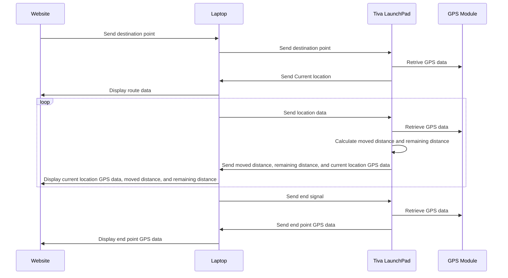

# GPS Tracking System

This project aims to develop a GPS system using TM4C123G LaunchPad to store the coordinates of a starting point and the endpoint, calculate the total distance traveled by the user, and provide an output through built-in LEDs based on the user's distance from the destination point.

# Additional Features

### 1. Map Navigation Web App

In addition to the GPS system, a web app has been created that reads data from the GPS module and connects to a map API to provide the user with a map and navigation experience. The web app allows the user to input their destination point and receive real-time directions to navigate to the destination. The web app also displays the user's current location on the map, making it easier for the user to track their progress.

### 2. LCD Display

An LCD has been added to the system to provide additional information to the user about the distance traveled and the current state of the system. The LCD displays the distance traveled by the user and the current state of the system, which is indicated by the built-in LEDs. The distance traveled is calculated by the GPS subsystem, and the current state of the system is determined by the distance from the destination point. The LCD display enhances the user experience by providing real-time information about the system.

## LED Indicators

The LED indicators have three stages:

1.  Stage 1: The built-in LED will be turned on (green) when the target destination is reached.
2.  Stage 2: The built-in LED will be turned on (yellow) when the target destination is about to be reached < 5 meters.
3.  Stage 3: The built-in LED will be turned on (red) when the target destination is far away by distance > 5 meters.

## System Diagram

## Testing the Accuracy and Efficiency
To test the accuracy and effectiveness of our web app, we compared it to Google Maps. Both our web app and Google Maps were used to navigate to a specific destination point and were found to provide accurate directions and display the user's location on the map.

## Language and Tools Used
The following programming languages and tools were used in the development of the GPS Tracking System:

1. C programming language for microcontroller code development using Keil 4
2. HTML, CSS, and JavaScript for the web app development
3. Microsoft Bing Maps API for the map and navigation features
4. Tiva TM4C123G LaunchPad
5. GPS neo 6 module for retrieving GPS data
6. LCD for displaying information

## Credits

|Name            				|ID                         |
|-------------------------------|-----------------------------|
Ahmed Adel Abdelrahman          |2001778            |
Abdelrahman ali Mohamed        	|2000460           |
Amr Essam Mahmoud Anwar			|2001089			|
Ahmed Sherif Mohamed       	    |2001547          
Amr mostafa mohamed             |2001931         |
Abdulrahman Ibrahim Abdulaziz	|2000925|
Hazem mohamed mohamed       	|2002286       |
Aly Ayman Ibrahim      			|2000921           |

